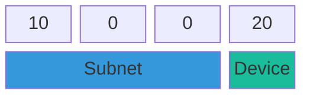
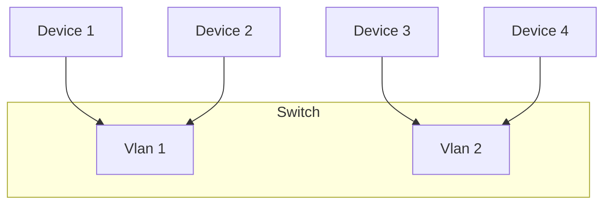
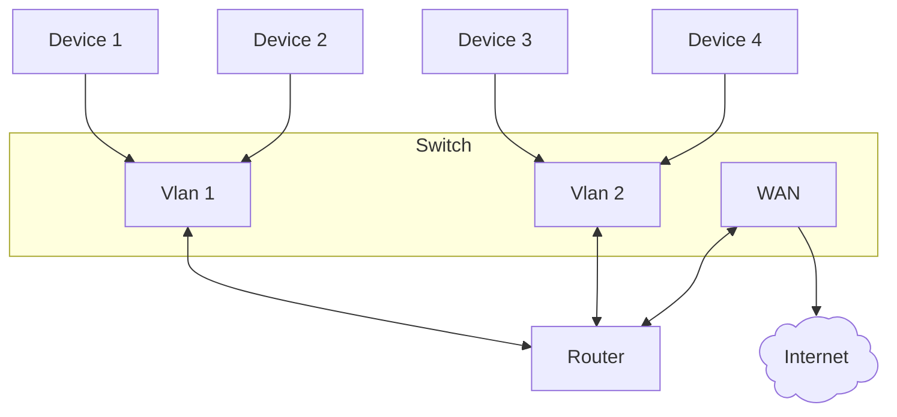
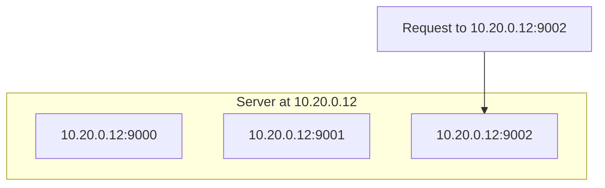

## IP Addresses

Every device on a network needs a unique identifier in order to establish communication
with other devices. For this we use **IP Addresses**. 

An IP address is 32 bits, and it's divided into 4 octets. It ends up looking something like `10.20.30.40`.

### IP Address Classes

IPv4 originally divided addresses into classes (A, B, C, D, E). Modern networks use [CIDR](../../homelab-topics/networking/cidr.md) instead,
so the class you pick for your homelab network doesn't matter and it's more of a stylistic choice.

We'll cover the common IP address classes nonetheless, for your own knowledge.

**Class A — 10.0.0.0/8**

Range: 10.0.0.0 – 10.255.255.255

Default mask: 255.0.0.0

**Class B — 172.16.0.0/12**

Range: 172.16.0.0 – 172.31.255.255

Default mask: 255.240.0.0

**Class C — 192.168.0.0/16**

Range: 192.168.0.0 – 192.168.255.255

Default mask: 255.255.255.0

## Subnetting

A network can have subnets, essentially creating networks within a network. This allows you
to organize different types of devices into different subnets, and control access between
subnets.

We won't get into the math behind subnetting right now, but the general pattern is,
the more subnets within a network, the less devices per subnet, and vice-versa.

### Subnet Masks

A subnet mask tells you which pieces of an IP address belong to the subnet, and which
belong to a device.

If we had IP: `10.0.0.20`

With subnet mask `255.255.255.0`

Then it means:

This can also be represented as:

`10.0.0.20/24`

See [CIDR](../../homelab-topics/networking/cidr.md) for further explanation of that syntax.

Meaning that the first 24 bits of the IP address are used for the subnet.

### Basic subnetting math

With the example above, how many devices can we have with a subnet mask of `255.255.255.0`?

We get one octet for the device portion. An octet is eight bytes so it has a max value of 255.

So we can have 255 devices right? **Wrong**

We can have 253 devices, because on every subnet, the first address is reserved for the
gateway IP, and the last address is the broadcast IP.

We will discuss these further below.

## Routing

Our network packets need to get to the correct device based on the IP address we're sending to.
That's what a router does.

### Gateway IP

The gateway IP is just the IP address of the router. The gateway IP is always the first available IP
on a given subnet.

For example, if we have a subnet mask of `255.255.255.0` and our IP addressing scheme is `10.20.0.x`,
then our gateway IP will be `10.20.0.1`.

### Broadcast IP

Sometimes you need to send a packet to every other device on the subnet, that's where the broadcast IP
comes in. The broadcast IP is always the last available address on the subnet.

For example, if we have a subnet mask of `255.255.255.0` and our IP addressing scheme is `10.20.0.x`,
then our broadcast IP will be `10.20.0.255`.

### VLANs

If a subnet is the logical separation of a network, then VLANs are the physical separation.

VLANs allow you to create virtual switches inside your physical switch. Picture it like this:

Device 1 and 2 can talk to each other

Device 3 and 4 can talk to each other

Inter VLAN communication can only occur if you allow it in your router rules.

So where does the router fit into all of this?

Let's expand our diagram:

The router is the "trunk" that connects all the VLANs to each other and to the internet. In this case,
WAN is just a special VLAN that we use to route traffic between our internal network(s) and the outside
internet which is itself, just another network.

### Ports

An IP address lets us find a device on a network, but one device can run many network connected applications.
So how do we specify which application we want to communicate with? That's where the second part of an IP
address comes in, the port.

We have server 1 running three apps on ports:

- 9000
- 9001
- 9002

We want to reach the app running on port 9002 so we hit [ip]:[port].

### DHCP

DHCP or "Dynamic Host Configuration Protocol" is a fancy way of describing the process
of automatically handing out an IP when a new device connects to your network.

DHCP can be disabled in some cases. For example, if you don't want the IP of your servers randomly
changing, then disabling DHCP for that network is a good idea. 

On your WiFi network though, you might want to leave DHCP on unless you want to manually set the IP
of every device that connects.