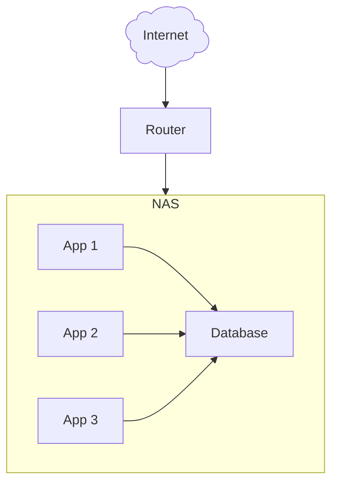

Your homelab journey doesn't have to start with a full size server rack
and a complex, high availability system. As a matter of fact, you can start
self hosting with just a single computer.

While this computer could be a single mini PC, I highly recommend to use a [NAS](/hardware/nas)
as they can be built for little money, and provide a robust storage solution as well as a
simple built in way to deploy applications.

## High level overview

