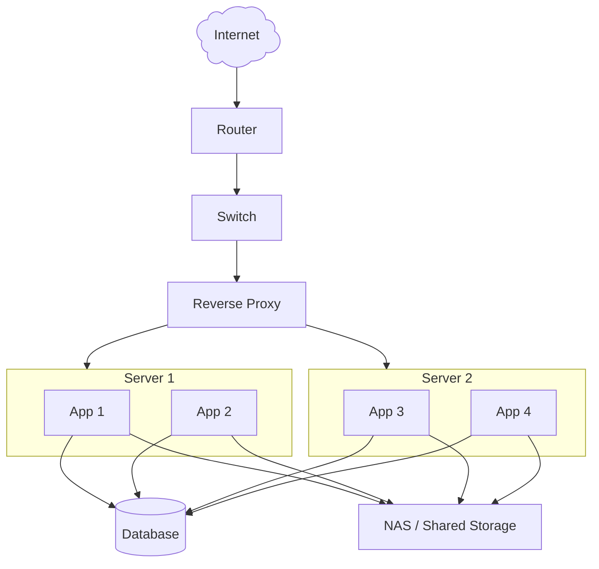
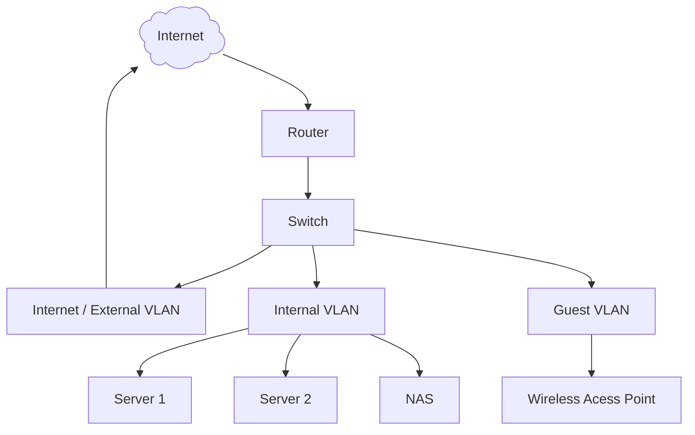
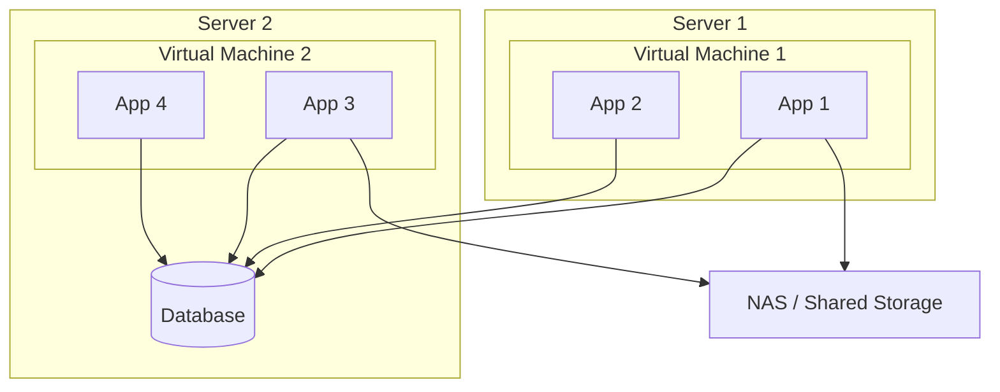

Although it doesn't take much to start self hosting, if you're planning to make this
a serious thing where you can host anything you want in the future, it's worth it to
invest in a slightly more elaborate setup.

## High level infrastructure setup

## Networking overview

You'll want to have [vLANs](../../../../homelab-topics/networking/vlans.md) to easily control and separate network traffic in your lab.

## Application infrastructure overview

The amount of servers is optional. You can have a single server running all the virtual machines.
Multiple servers are used in the diagram to showcase the possible setup.

Your servers will have virtual machines with running the applications. Any application might use
the database, shared storage, or both.

