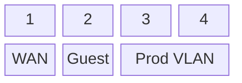
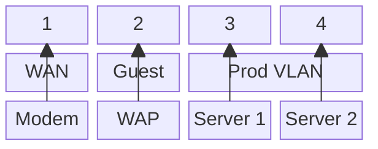

# Configuring VLANs

VLANs need to be configured on both your switch and your router.

## On the switch

The way to do this will depend on the specific switch you have, but most
will have some sort of UI to manage this.

For this guide we'll be configuring the following VLANs:

- WAN: **Very important**. No matter what other vlans you have, the WAN vlan
needs to be configured as it's what allows you to connect traffic from your other
VLANs to the internet.
- Guest: Think WiFi or any other network you have that's not where your servers are.
- Prod: Where your servers and VMs will be.

Steps:

1. Add your VLANs to the switch
2. Assign one of the ports to the WAN VLAN
3. Make the port assigned to the WAN VLAN a trunk port.
This is important so that traffic from any VLAN can connect to the internet.
4. Connect your modem to the WAN port on your switch.
5. Assign ports to the guest VLAN.
6. Connect your WAP to one of the guest vlan ports on your switch.
7. Assign the other ports to the prod VLAN

**VLAN Diagram**

Let's assume we have a 4 port switch for simplicity.
This is what the port configuration should be:

**Connection Diagram**

## On the router

Once you install OPNSense, you have to:

1. Configure the devices (one for each VLAN). Essentially
multiplexing your NIC for the different VLANs. This is ok
since all modern NICs are VLAN aware.
2. Configure the interfaces on the OPNSense UI (one for each VLAN).
3. Assing each interface to its proper device.